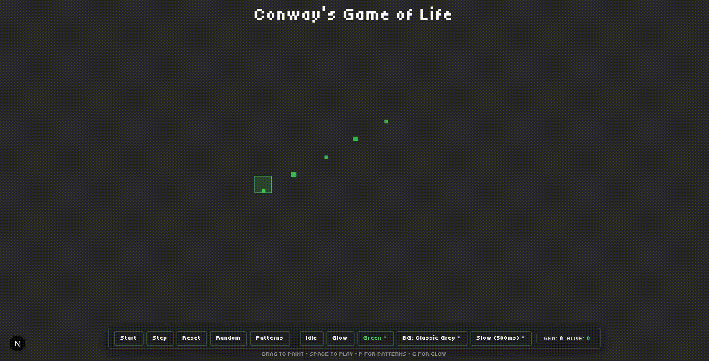

# Conway's Game of Life

<p align="center">
  <a href="https://nextjs.org/"></a>
  <a href="https://react.dev/"></a>
  <a href="https://www.typescriptlang.org/"></a>
  <a href="https://tailwindcss.com/"></a>
  <a href="LICENSE"></a>
</p>

Implementation of the famous cellular automaton devised by mathematician John Conway in 1970.

<p align="center">
  
</p>

## Features

- **Web worker simulation.** Grid calculation and idle pattern generation run on a background worker thread.
- **Preset library.** Includes 20 built-in patterns across spaceships, guns, oscillators, still lifes, and methuselahs.
- **Pattern export & sharing.** Box-select any region or full board to export as standard `.rle` or `.cells` files, copy RLE snippets directly to your clipboard, or generate shareable URLs (`?rle=...&theme=...`).
- **Custom pattern import.** Paste raw text or drop in `.rle` and `.cells` files from [LifeWiki](https://conwaylife.com/wiki/). The parser checks syntax and shows a preview before placing cells on the grid.
- **Visual effects.** Toggleable cell glow, aging color shifts as cells survive generations, and a pixel cursor trail.
- **Playback controls.** Step one generation at a time, pause, randomize, or run at speeds down to 40 ms per tick.

## How the simulation works

The grid wraps around toroidally at the edges. Every tick calculates the next state using Conway's four rules:

1. **Underpopulation:** A live cell with fewer than two live neighbors dies.
2. **Survival:** A live cell with two or three live neighbors lives on.
3. **Overpopulation:** A live cell with more than three live neighbors dies.
4. **Reproduction:** A dead cell with exactly three live neighbors becomes a live cell.

---

## Running locally

### Prerequisites

- [Node.js](https://nodejs.org/) 20 or later
- [pnpm](https://pnpm.io/installation)

### Setup

1. Clone the repository:

```bash
git clone https://github.com/SoulDev07/Conway-Game-of-Life.git
```

2. Navigate to the project directory:

```bash
cd Conway-Game-of-Life
```

3. Install dependencies:

```bash
pnpm install
```

4. Start the development server:

```bash
pnpm dev
```

5. Open [http://localhost:3000](http://localhost:3000) in your browser.

To create a production build:

```bash
pnpm build
```

To run the production server:

```bash
pnpm start
```

---

## License

This project is licensed under the [MIT License](LICENSE).
