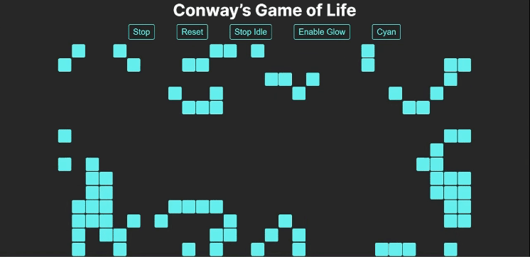

# Conway Game of Life

This project is an implementation of the famous cellular automaton devised by mathematician John Conway. The game is built using React and Next.js 14.

- Experience the classic Conway Game of Life on your web browser.
- Watch as cells evolve based on simple rules and create mesmerizing patterns.




[Conway Game of Life Demo](https://SoulDev07.github.io/Conway-Game-of-Life)

## Features

- **Start Button:** Initiate or resume the simulation to observe the cells evolve over time.
- **Reset Button:** Clear the board and start a new simulation.
- **Idle Button:** Turn on automatic simulation mode and see the simulation unfold itself.

### Rules

The Conway Game of Life follows a few simple rules:

1. **Underpopulation:** A live cell with fewer than two live neighbors dies.
2. **Survival:** A live cell with two or three live neighbors survives.
3. **Overpopulation:** A live cell with more than three live neighbors dies.
4. **Reproduction:** A dead cell with exactly three live neighbors becomes a live cell.

## Getting Started

To run the Conway Game of Life on your local machine, follow these steps:

1. **Clone the Repository:**

```bash
git clone https://github.com/SoulDev07/Conway-Game-of-Life.git
```

2. **Navigate to the Project Directory:**

```bash
cd Conway-Game-of-Life
```

3. **Install Dependencies:**

```bash
npm install
```

4. **Run the Application:**

```bash
npm run dev
```

5. **Open in Browser:**

   Visit http://localhost:3000 to interact with the Conway Game of Life.

## Tech Stack

- React
- Next.js

## License

This project is licensed under the [MIT License](LICENSE).
